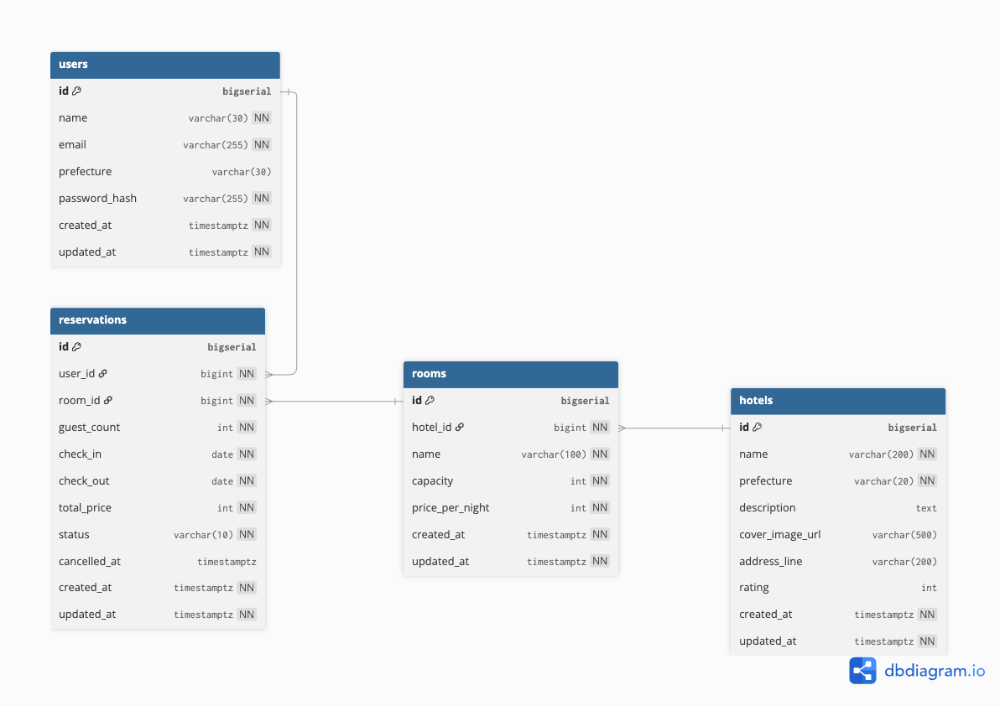

# Travel Booking Site

A full-stack travel booking web application.
旅行予約サイトのポートフォリオとして開発中。

## Tech Stack

### Backend
- Next.JS(Node.js)
- TypeScript
- Prisma ORM
- PostgreSQL (Docker)

### Frontend
- React
- TypeScript

## Database Design

## API
[API Specification](./docs/api-spec.md)

## Git Workflow
本プロジェクトでは、featureブランチをベースとしたシンプルなGit運用を採用しています。
- `main`: 本番用の安定ブランチ
- `develop`: 開発内容を統合するブランチ
- `feature/*`: 機能ごとに作成する開発用ブランチ（例: feature/auth, feature/reservation）※2026/4/3〜運用開始

## Project status
 - プロジェクトスタート！: 2026/03/31
 - 環境構築完了！： 2026/4/3
 - API（auth(register/login), me ）実装完了：2026/4/5
 - API（hotels（空室検索対応）, rooms）実装完了：2026/4/6